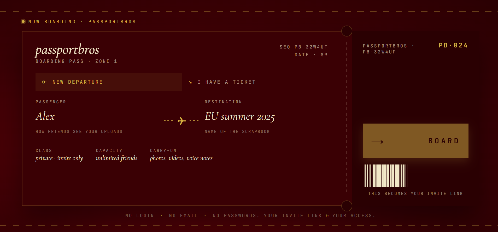
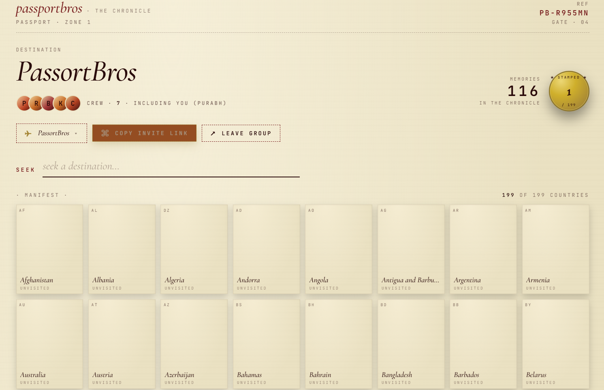
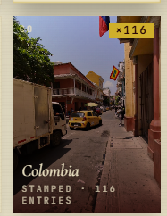
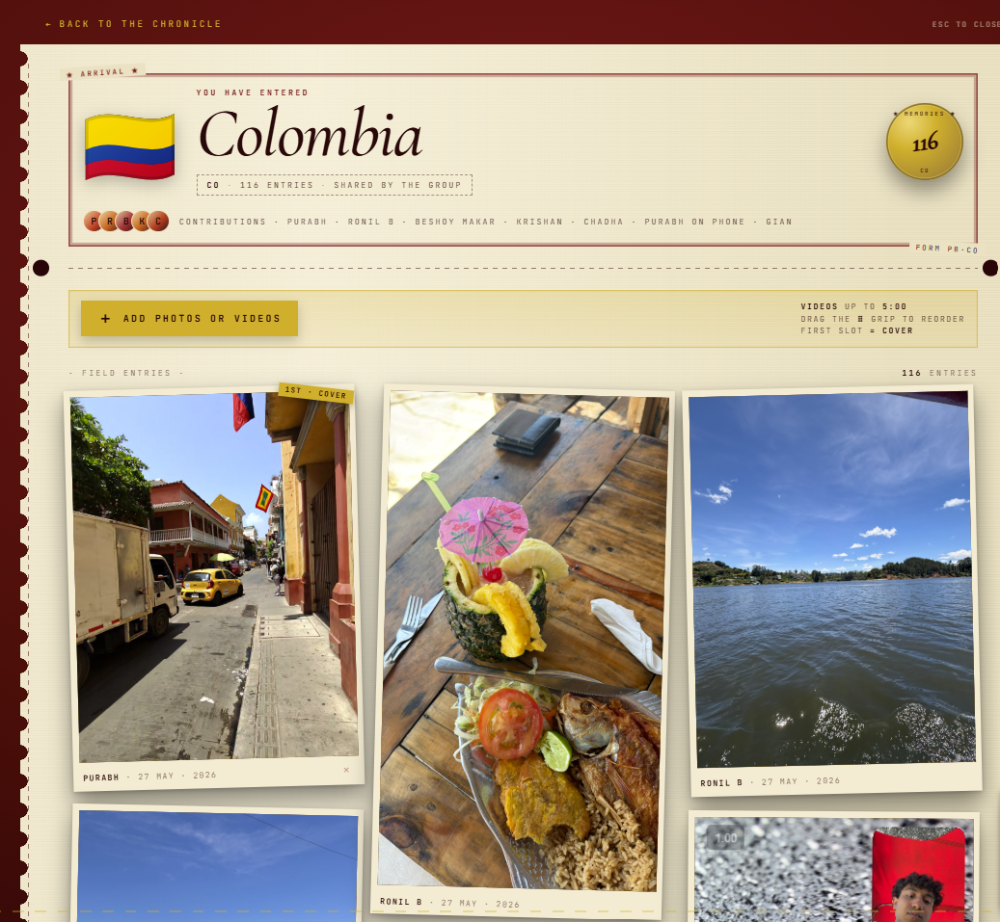

# r/PassportBros

A shared travel scrapbook for you and your friends. Anyone with the invite
link can join, post photos and videos to each country, and see what
everyone else has shared. No passwords, no email signups.

Deployed on Vercel · Postgres on Neon · files on Cloudflare R2.

## Screenshots

| Boarding pass (landing) | Chronicle (group home) |
|---|---|
|  |  |

| Country tile | Country detail |
|---|---|
|  |  |

## Run it locally

```bash
npm install
cp .env.example .env       # fill in DATABASE_URL + R2_* + COOKIE_SECRET
npm run migrate            # one-time, creates the Postgres tables
npm run dev                # API on :3001, vite on :5173 (proxies /api to :3001)
```

Then open **http://localhost:5173**.

To build the production bundle locally:

```bash
npm run build              # writes dist/
```

## Deploy to Vercel

1. Push this repo to GitHub.
2. In Vercel: `Add New Project` → import the GitHub repo.
3. Set environment variables (Settings → Environment Variables):

   | Name | Where to find it |
   |---|---|
   | `DATABASE_URL` | Neon → your project → Connection Details |
   | `R2_ACCOUNT_ID` | Cloudflare Dashboard → R2 → top right |
   | `R2_ACCESS_KEY_ID` | R2 → Manage R2 API Tokens → created token |
   | `R2_SECRET_ACCESS_KEY` | same place; shown once at creation |
   | `R2_BUCKET` | e.g. `passportbros-media` |
   | `R2_PUBLIC_BASE_URL` | optional, e.g. `https://pub-xxx.r2.dev` if you enable public access |
   | `COOKIE_SECRET` | any long random string (`openssl rand -hex 32`) |

4. Deploy.
5. After first deploy, run migrations once against the production DB:
   `DATABASE_URL=<prod url> npm run migrate`

## How it works

```
Browser (React SPA)
   ↓
Vercel  ── static SPA  +  /api/* serverless functions
   ↓                                    ↓
Neon Postgres (groups/members/uploads)   Cloudflare R2 (photos + videos)
```

**Auth model.** Every group has a long random ID (`xY8nQ3kP42aBc7HmK5jL2`)
that lives in the URL path: `passportbros.app/g/<id>`. Anyone with that URL
can open the join page, pick a display name, and become a member. Each
member gets a personal `member_token` stored in `localStorage`. it's
their session. The URL plus your token = your access. No passwords.

**Uploads.** Browser asks the API to sign an upload URL; the API checks
quota/type/duration limits, then signs a presigned R2 PUT URL valid for 15
minutes. The browser PUTs the file directly to R2 (bypassing Vercel's
4.5MB body limit, so a 500MB video works). When the upload finishes, the
browser calls the API again to register the upload in the database.

**Video duration cap.** Enforced twice: client-side reads the file's
duration via a hidden `<video>` element before uploading; server-side
re-checks the metadata when signing the URL. Anything > 5:00 is rejected.

## Schema

```sql
groups   (id, name, created_at)
members  (id, group_id, display_name, member_token, created_at)
uploads  (id, group_id, member_id, country_code, kind, r2_key,
          original_filename, content_type, size_bytes, duration_sec, created_at)
```

## File layout

```
PassportBros/
├── api/                          # Vercel serverless functions
│   ├── _lib/                     # shared utilities (db, auth, r2, ids, json)
│   ├── groups.js                 # POST create
│   └── groups/[id]/
│       ├── index.js              # GET group info
│       ├── members.js            # POST join
│       ├── data.js               # GET all data for SPA
│       ├── uploads.js            # POST register / DELETE
│       └── uploads/sign.js       # POST presigned R2 URL
├── migrations/001-init.sql       # schema
├── migrate.js                    # runs migrations against DATABASE_URL
├── dev-server.js                 # Express shim - mounts api/ for local dev
├── countries.json                # 199 countries (ISO code, name, flag)
├── src/
│   ├── main.jsx + App.jsx        # React entry + router
│   ├── api.js                    # fetch helpers + R2 upload helper
│   ├── pages/
│   │   ├── Landing.jsx           # create-or-join landing
│   │   ├── JoinGroup.jsx         # display-name capture for newcomers
│   │   └── GroupHome.jsx         # the scrapbook
│   └── components/Scrapbook.jsx  # dragon + grid + per-country gallery
├── public/dragon.png
├── vercel.json
└── README.md
```

## What's deferred

The first version focuses on the core multi-user flow. Coming soon:

- Drag-to-reorder per country (UX decision needed: per-member or group-shared?)
- Pin a "cover" photo per country instead of newest-wins
- Rotate the invite link / kick a member
- Captions and dates (the data model already has room - just needs UI)
- Push notifications when a friend posts

## License

Personal use for you and your friends.
